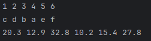
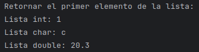
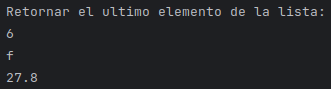
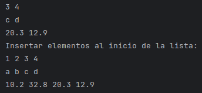

# Explicacion de Linked List

## Indice
1. [`front`](#front)
2. [`back`](#back)
3. [`push_front`](#push_front)
4. [`push_back`](#push_back)
5. [`pop_front`](#pop_front)
6. [`pop_back`](#pop_back)
7. [`operator[]`](#operator)
8. [`empty`](#empty)
9. [`size`](#size)
10. [`clear`](#clear)
11. [`sort`](#sort)
12. [`reverse`](#reverse)

## Métodos de LinkedList



### `front` <a name="front"></a>
#### Objetivo: 
Retornar el elemento del comienzo

#### Lenguaje de alto nivel
1. Se retorna el primer elemento que ya se tiene apuntando de la lista.

#### Explicacion del codigo
1. Se hace un return al head, el cual marca el primer nodo de la lista.

```
return head->val;
```

#### Pruebas

##### Codigos de test
```
cout << list.front() << endl;
cout << list2.front() << endl;
cout << list3.front() << endl;
```

##### Resultados de test



### `back` <a name="back"></a>
#### Objetivo:
Retornar el elemento al final

#### Lenguaje de alto nivel
1. Se empieza desde el primero nodo de la lista (head).
2. Se recorre la lista hasta encontrar el último nodo.
3. Al encontrar el último nodo se retorna su valor.

#### Explicacion del codigo
1. Se crea un puntero temp que apunte al head (primer nodo de la lista)

```
Node<T> *temp = head;
```

2. Se itera mientras el nodo actual tenga un segundo nodo

```
while (temp->next) {
        temp = temp->next;
    }
```

3. Se retorna el valor del último nodo

```
return temp->val;
```

#### Pruebas

##### Codigos de test
```
cout << list.back() << endl;
cout << list2.back() << endl;
cout << list3.back() << endl;
```

##### Resultados de test



### `push_front` <a name="push_front"></a>
#### Objetivo:
Retornar el elemento al final

#### Lenguaje de alto nivel
1. Se crea un nodo con el valor qu ese quiere insertar.
2. Este nodo se conecta con el primer nodo de la lista.
3. Se actualiza el head para que paunte al nuevo primer nodo.

#### Explicacion del codigo
1. Se crea de forma dinamica un nuevo nodo con el valor dado.

```
auto *newNode = new Node<T>(value);
```

2. El puntero "next" del nuevo nodo apunta al nodo actual que está en la cabeza.

```
newNode->next = head;
```

3. La cabeza de la lista ahora pasa a ser el nuevo nodo.

```
head = newNode;
```

#### Pruebas

##### Codigos de test
```
list.push_front(2);
list.push_front(1);
list2.push_front('b');
list2.push_front('a');
list3.push_front(32.8);
list3.push_front(10.2);
```

##### Resultados de test


### `push_back` <a name="push_back"></a>
Texto 4

### `pop_front` <a name="pop_front"></a>
Texto 5

### `pop_back` <a name="pop_back"></a>
Texto 6

### `operator[]` <a name="operator"></a>
Texto 7

### `empty` <a name="empty"></a>
Texto 8

### `size` <a name="size"></a>
Texto 9

### `clear` <a name="clear"></a>
Texto 10

### `sort` <a name="sort"></a>
Texto 11

### `reverse` <a name="reverse"></a>
Texto 12