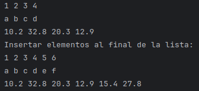
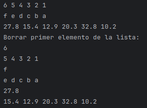
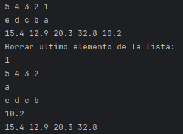
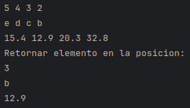
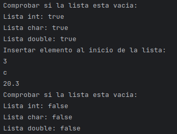
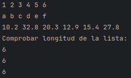
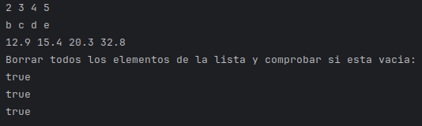
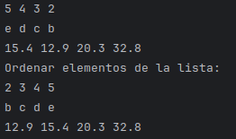
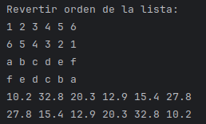

# Explicacion de Linked List

## Participantes

- **Montoya Solórzano, Leonardo Alfredo**
- **Guerrero Cueva, José Ernesto**
- **Sulca Infante, Esteban Jose**

## Indice
1. [`estructura`](#estructura)
2. [`metodos`](#metodos)

   &nbsp;&nbsp;&nbsp;&nbsp;2.1. [`front`](#front)  
   &nbsp;&nbsp;&nbsp;&nbsp;2.2. [`back`](#back)  
   &nbsp;&nbsp;&nbsp;&nbsp;2.3. [`push_front`](#push_front)  
   &nbsp;&nbsp;&nbsp;&nbsp;2.4. [`push_back`](#push_back)  
   &nbsp;&nbsp;&nbsp;&nbsp;2.5. [`pop_front`](#pop_front)  
   &nbsp;&nbsp;&nbsp;&nbsp;2.6. [`pop_back`](#pop_back)  
   &nbsp;&nbsp;&nbsp;&nbsp;2.7. [`operator[]`](#operator)  
   &nbsp;&nbsp;&nbsp;&nbsp;2.8. [`empty`](#empty)  
   &nbsp;&nbsp;&nbsp;&nbsp;2.9. [`size`](#size)  
   &nbsp;&nbsp;&nbsp;&nbsp;2.10. [`clear`](#clear)  
   &nbsp;&nbsp;&nbsp;&nbsp;2.11. [`sort`](#sort)  
   &nbsp;&nbsp;&nbsp;&nbsp;2.12. [`reverse`](#reverse)

## 1. `estructura` <a name="front"></a>

Los archivos que conforman esta estructura de datos son las siguientes:

- **Node.h:** Contiene una estructura que conforma el nodo (valor y el nodo siguiente), para que desde la clase pueda acceder a sus atributos. 
- **eLinkedList.h:** Incluye la estructura del nodo creado en **Node.h** y con eso conforma clase de la lista, la cual cuenta con un atributo que apunta al primer nodo de la lista (head) además de la cabecera de todos los métodos.
- **eLinkedList.tpp:** Contiene las estructura de todos los métodos de la lista.
- **main.cpp:** Contiene los test de cada método.

## 2. `metodos` <a name="front"></a>

Aprovechando que se está trabajando con templates, se establecen 3 listas con tipos de datos diferentes (int, char y double), como se puede ver en la imagen de abajo, sobre estas listas pasaran a realizar los test.


### 2.1. `front` <a name="front"></a>
#### Objetivo: 
Retornar el elemento del comienzo

#### Lenguaje de alto nivel
1. Se retorna el primer elemento que ya se tiene apuntando de la lista.

#### Explicacion del codigo
1. Se hace un return al head, el cual marca el primer nodo de la lista.

```c++
return head->val;
```

#### Pruebas

##### Codigos de test
```c++
cout << list.front() << endl;
cout << list2.front() << endl;
cout << list3.front() << endl;
```

##### Resultados de test


### 2.2. `back` <a name="back"></a>
#### Objetivo:
Retornar el elemento al final

#### Lenguaje de alto nivel
1. Se empieza desde el primero nodo de la lista (head).
2. Se recorre la lista hasta encontrar el último nodo.
3. Al encontrar el último nodo se retorna su valor.

#### Explicacion del codigo
1. Se crea un puntero temp que apunte al head (primer nodo de la lista)

```c++
Node<T> *temp = head;
```

2. Se itera mientras el nodo actual tenga un segundo nodo

```c++
while (temp->next) {
        temp = temp->next;
    }
```

3. Se retorna el valor del último nodo

```c++
return temp->val;
```

#### Pruebas

##### Codigos de test
```c++
cout << list.back() << endl;
cout << list2.back() << endl;
cout << list3.back() << endl;
```

##### Resultados de test


### 2.3. `push_front` <a name="push_front"></a>
#### Objetivo:
Agregar elemento al comienzo

#### Lenguaje de alto nivel
1. Se crea un nodo con el valor qu ese quiere insertar.
2. Este nodo se conecta con el primer nodo de la lista.
3. Se actualiza el head para que paunte al nuevo primer nodo.

#### Explicacion del codigo
1. Se crea de forma dinamica un nuevo nodo con el valor dado.

```c++
auto *newNode = new Node<T>(value);
```

2. El puntero "next" del nuevo nodo apunta al nodo actual que está en la cabeza.

```c++
newNode->next = head;
```

3. La cabeza de la lista ahora pasa a ser el nuevo nodo.

```c++
head = newNode;
```

#### Pruebas

##### Codigos de test
```c++
list.push_front(2);
list.push_front(1);
list2.push_front('b');
list2.push_front('a');
list3.push_front(32.8);
list3.push_front(10.2);
```

##### Resultados de test


### 2.4. `push_back` <a name="push_back"></a>
#### Objetivo:
Agregar elemento al final

#### Lenguaje de alto nivel
1. Se crea un nuevo nodo con el valor que se desea insertar.
2. Si la lista está vacía (es decir, no hay ningún nodo), ese nuevo nodo se convierte en el primer nodo (la cabeza o head).
3. Si ya hay nodos en la lista:
- Se recorre la lista desde el inicio (head) hasta llegar al último nodo. 
- Luego, se enlaza el nuevo nodo al final de la lista.

#### Explicacion del codigo
1. Crea dinámicamente un nuevo nodo (newNode) con el valor proporcionado. Este nodo será agregado a la lista.

```c++
auto *newNode = new Node<T>(value);
```

2. Verifica si la lista está vacía (head es nullptr). Si lo está, el nuevo nodo se convierte en el primer nodo de la lista (se asigna a head).

```c++
if (head == nullptr) {
        head = newNode;
```

3. Si la lista no está vacía, se declara un puntero temp que empieza apuntando al primer nodo (head).

```c++
} else {
        Node<T> *temp = head;
```

4. Se recorre la lista nodo por nodo hasta encontrar el último (cuando temp->next es nullptr).

```c++
while (temp->next) {
    temp = temp->next;
}
```

5. Se enlaza el nuevo nodo al final de la lista, haciendo que el último nodo actual (temp) apunte a newNode.

```c++
temp->next = newNode;
```

#### Pruebas

##### Codigos de test
```c++
list.push_back(5);
list.push_back(6);
list2.push_back('e');
list2.push_back('f');
list3.push_back(15.4);
list3.push_back(27.8);
```

##### Resultados de test



### 2.5. `pop_front` <a name="pop_front"></a>
#### Objetivo:
Remueve el elemento al comienzo

#### Lenguaje de alto nivel
1. Se obtiene el valor del primer nodo (cabeza).
2. Se elimina el primer nodo de la lista.
3. Se actualiza la cabeza para que apunte al siguiente nodo.
4. Se retorna el valor del nodo eliminado.

#### Explicacion del codigo
1. Guarda el valor del primer nodo (**head**) en la variable **val**.

```c++
T val = head->val;
```

2. Se crea un puntero **temp** que apunta al primer nodo (para poder eliminarlo luego).

```c++
Node<T> *temp = head;
```

3. Se actualiza la cabeza de la lista para que apunte al segundo nodo (es decir, el que sigue del que se va a eliminar).

```c++
head = head->next;
```

4. Se elimina el nodo original (el anterior **head**) liberando su memoria.

```c++
delete temp;
```

5. Se retorna el valor que estaba almacenado en el nodo eliminado.

```c++
return val;
```

#### Pruebas

##### Codigos de test
```c++
cout << list.pop_front() << endl;
list.show();

cout << list2.pop_front() << endl;
list2.show();

cout << list3.pop_front() << endl;
list3.show();
```

##### Resultados de test



### 2.6. `pop_back` <a name="pop_back"></a>
#### Objetivo:
Remueve el elemento al final

#### Lenguaje de alto nivel
1. Se recorre la lista hasta llegar al penúltimo nodo.
2. Se elimina el último nodo.
3. Se retorna el valor del nodo eliminado.

#### Explicacion del codigo
1. Se crea un puntero tmp que empieza en el nodo head.

```c++
Node<T>* tmp = head;
```

2. Se recorre la lista hasta llegar al penúltimo nodo con tmp->next->next.

```c++
while(tmp->next->next){
        tmp = tmp->next;
    }
```

3. Se guarda el valor del último nodo antes de borrarlo.

```c++
T val = tmp->next->val;
```

4. Se libera la memoria del último nodo y se actualiza el next del penúltimo nodo a nullptr.

```c++
delete tmp->next;
tmp->next = nullptr;
```

5. Se retorna el valor del nodo eliminado.

```c++
return val;
```

#### Pruebas

##### Codigos de test
```c++
cout << list.pop_back() << endl;
list.show();

cout << list2.pop_back() << endl;
list2.show();

cout << list3.pop_back() << endl;
list3.show();
```

##### Resultados de test



### 2.7. `operator[]` <a name="operator"></a>
#### Objetivo:
Retorna el elemento en la posición indicada

#### Lenguaje de alto nivel
1. Se recorre la lista hasta el índice especificado.
2. Se devuelve una referencia al valor del nodo en esa posición.

#### Explicacion del codigo
1. Se inicializa un puntero tmp al inicio de la lista (head).

```c++
Node<T>* tmp = head;
```

2. Se avanza por la lista index veces con un bucle for.

```c++
for(int i = 0; i < index; i++)
```

3. Al finalizar el bucle, tmp apunta al nodo en la posición index.

```c++
tmp = tmp->next;
```

4. Se libera la memoria del último nodo y se actualiza el next del penúltimo nodo a nullptr.

```c++
return tmp->val;
```

#### Pruebas

##### Codigos de test
```c++
cout << list[2] << endl;
cout << list2[3] << endl;
cout << list3[1] << endl;
```

##### Resultados de test



### 2.8. `empty` <a name="empty"></a>
#### Objetivo:
Retorna si la lista esta vacia o no

#### Lenguaje de alto nivel
1. Se revisa si el puntero head es nullptr.
2. Si lo es, la lista está vacía y se retorna true.
3. De lo contrario, hay al menos un nodo, así que se retorna false.

#### Explicacion del codigo
1. Retorna la evaluación head == nullptr, se devuelve true si la lista está vacía y false si tiene elementos

```c++
return head == nullptr;
```

#### Pruebas

##### Codigos de test
```c++
cout << "Comprobar si la lista esta vacia: " << endl;
cout << "Lista int: " << boolalpha << list.empty() << endl;
cout << "Lista char: " << boolalpha << list.empty() << endl;
cout << "Lista double: " << boolalpha << list.empty() << endl;

cout << "Insertar elemento al inicio de la lista: " << endl;
list.push_front(3);
list2.push_front('c');
list3.push_front(20.3);
list.show();
list2.show();
list3.show();

cout << "Comprobar si la lista esta vacia: " << endl;
cout << "Lista int: " << boolalpha << list.empty() << endl;
cout << "Lista char: " << boolalpha << list.empty() << endl;
cout << "Lista double: " << boolalpha << list.empty() << endl;
```

##### Resultados de test



### 2.9. `size` <a name="size"></a>
#### Objetivo:
Retorna el tamaño de la lista

#### Lenguaje de alto nivel
1. Se inicia un contador en 0.
2. Se recorre la lista nodo por nodo comenzando desde head.
3. Por cada nodo encontrado, se incrementa el contador.
4. Al llegar al final (cuando el puntero es nullptr), se devuelve el valor del contador.

#### Explicacion del codigo
1. Se empieza desde el primer nodo.

```c++
Node* current = head;
```

2. Se recorre hasta el final de la lista.

```c++
while(current != nullptr)
```

3. Cada vez que encontramos un nodo, lo contamos.

```c++
count++;
```

4. Avanzamos al siguiente nodo.

```c++
current = current->next;
```

5. Al final, se devuelve el número total de nodos encontrados.

```c++
return count;
```

#### Pruebas

##### Codigos de test
```c++
cout << list.size() << endl;
cout << list2.size() << endl;
cout << list3.size() << endl;
```

##### Resultados de test



### 2.10. `clear` <a name="clear"></a>
#### Objetivo:
Elimina todos los elementos de la lista

#### Lenguaje de alto nivel
1. Guardar una referencia al nodo actual (head).
2. Mover head al siguiente nodo.
3. Eliminar el nodo previamente guardado.

#### Explicacion del codigo
1. Se repite mientras haya nodos en la lista.

```c++
while (head != nullptr)
```

2. Se guarda temporalmente el nodo actual.

```c++
Node* temp = head;
```

3. Se avanza al siguiente nodo.

```c++
head = head->next;
```

4. Se elimina el nodo anterior, liberando memoria.

```c++
delete temp;
```

#### Pruebas

##### Codigos de test
```c++
list.clear();
cout << boolalpha << list.empty() << endl;

list2.clear();
cout << boolalpha << list2.empty() << endl;

list3.clear();
cout << boolalpha << list3.empty() << endl;
```

##### Resultados de test



### 2.11. `sort` <a name="sort"></a>
#### Objetivo:
Ordena la lista enlazada

#### Lenguaje de alto nivel
1. **getMiddle**
- Usa la técnica del puntero lento y rápido para encontrar el nodo medio de la lista.
- Divide la lista para poder aplicar recursivamente Merge Sort.

2. **merge**
- Función recursiva que fusiona dos listas ordenadas en una sola lista ordenada.

3. **mergeSort**
- Aplica recursivamente Merge Sort sobre la lista enlazada, dividiéndola y luego fusionando las partes ordenadas.

4. **sort**
- Método público que inicia el proceso de ordenamiento sobre la cabeza de la lista.

#### Explicacion del codigo

- **getMiddle**

1. Verifica si el puntero es nulo.

```c++
if (!start) return nullptr;
```

2. Copia la dirección del nodo start a los registros slow y fast, pero fast se mueve un nodo adelante.

```c++
Node<T>* slow = start, *fast = start->next;
```

3. Itera comprobando si fast es distinto de nulo y que su siguiente también no sea nulo.

```c++
while (fast && fast->next)
```

4. Avanza los punteros.

```c++
slow = slow->next;
fast = fast->next->next;
```

4. Retorna el puntero slow, que estaría ubicado en la mitad de la lista.

```c++
return slow;
```

- **Merge**

1. Validaciones de punteros nulos

```c++
if (!left) return right;
if (!right) return left;
```

2. Compara valores de los nodos

```c++
if (left->val < right->val)
```

3. Llama recursivamente a merge() con el siguiente nodo de left y el nodo right, y guarda el resultado en left->next.

```c++
left->next = merge(left->next, right);
```

4. Devuelve el nodo left como el nuevo "cabeza" de la sublista fusionada.

```c++
return left;
```

- **mergeSort**

1. Valida si el nodo es nulo o si no hay siguiente.

```c++
if (!start || !start->next) return start;
```

2. Empuja start, llama a función.

```c++
Node<T> *mid = getMiddle(start);
```

3. Lee y modifica el puntero del nodo medio

```c++
Node<T>* midNext = mid->next;
mid->next = nullptr;
```

4. Llama a mergeSort() con la mitad izquierda de la lista (desde el nodo start hasta el nodo mid).

```c++
Node<T>* left = mergeSort(start);
```

4. Llama a mergeSort() con la mitad derecha (desde midNext hasta el final).

```c++
Node<T>* right = mergeSort(midNext);
```

5. Fusión de listas ordenadas.

```c++
return merge(left, right);
```

- **sort**

5. Inicia todo el proceso.

```c++
head = mergeSort(head);
```

#### Pruebas

##### Codigos de test
```c++
list.sort();
list.show();

list2.sort();
list2.show();

list3.sort();
list3.show();
```

##### Resultados de test



### 2.12. `reverse` <a name="reverse"></a>
#### Objetivo:
Revierte toda la lista

#### Lenguaje de alto nivel
1. Inicializamos tres variables:
- prev (anterior): para guardar el nodo previo al actual. Comienza siendo nullptr porque no hay nodo antes del primero.
- curr (actual): comienza apuntando a la cabeza de la lista.
- next (siguiente): también empieza en la cabeza.
2. Mientras haya un nodo actual (curr no sea nulo):
- Guardamos el siguiente nodo (next = curr->next).
- Hacemos que el actual apunte hacia atrás (curr->next = prev), invirtiendo el enlace.
- Avanzamos prev al actual (prev = curr).
- Y luego curr al siguiente (curr = next).
3. Al terminar, prev será el nuevo inicio de la lista, así que actualizamos head = prev.

#### Explicacion del codigo
1. prev apunta a nullptr, curr apunta a head y next también inicia en head.

```c++
Node<T> *prev = nullptr, *curr = head, *next = head;
```

2. Se entra en un bucle while (curr) que se ejecuta mientras curr no sea nullptr.

```c++
while (curr)
```

3. El puntero next del nodo actual se redirecciona hacia el nodo anterior (prev).

```c++
curr->next = prev;
```

4. El nodo actual pasa a ser el anterior.

```c++
prev = curr;
```

4. Se mueve al siguiente nodo (el que guardamos antes).

```c++
curr = next;
```

5. Se actualiza la cabeza de la lista para que ahora apunte al nuevo primer nodo

```c++
head = prev;
```

#### Pruebas

##### Codigos de test
```c++
list.show();
list.reverse();
list.show();

list2.show();
list2.reverse();
list2.show();

list3.show();
list3.reverse();
list3.show();
```

##### Resultados de test

